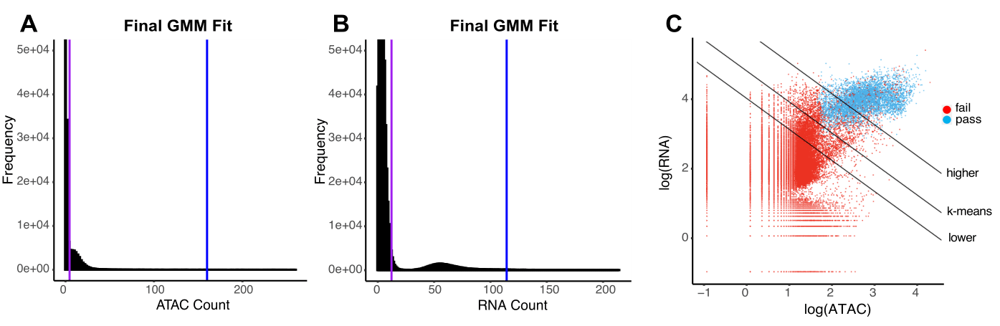

# EmptyDropsMultiome
[EmptyDropsMultiome](https://genomebiology.biomedcentral.com/articles/10.1186/s13059-024-03259-x) is a framework for statistically powerful and accurate detection of nuclei-containing droplets in single-cell GEX+ATAC multiome data. The method builds on a cell calling method for droplet-based scRNA data called EmptyDrops. It can deal with diverse samples (from highly homogeneous to highly heterogeneous) by creating the ATAC and RNA profile of the ambient noise and then testing each droplet for deviations from it.

## Installation

```

conda create -n eDm_env -c conda-forge r-base=4.3.0 -y
conda activate eDm_env
mamba install -c conda-forge r-devtools
R
> library(devtools)
> if (!require("BiocManager", quietly = TRUE))
    install.packages("BiocManager")
> BiocManager::install("DropletUtils")
> devtools::install_github("MarioniLab/emptyDrops_multiome",
                         ref="main")

# don't worry about curl package

```

## Vignette in R: for automatic detection of lower_rna and lower_atac

```
library(Seurat)
library(EmptyDropsMultiome)
sce <- Read10X_h5("/path/to/folder/raw_feature_bc_matrix.h5")
rna <- sce[["Gene Expression"]]
atac <- sce[["Peaks"]]
eD.out <- emptydrops_multiome(count_matrix_rna=rna, count_matrix_atac=atac)
print("the number of cells detected is: ")
print(sum(eD.out$FDR_multi<0.001 & ! is.na(eD.out$FDR_multi)))

```

## Vignette in R: for manual choice of lower_rna, barhop_rna, lower_atac and barhop_atac

```
library(Seurat)
library(EmptyDropsMultiome)
sce <- Read10X_h5("/path/to/folder/raw_feature_bc_matrix.h5")
rna <- sce[["Gene Expression"]]
atac <- sce[["Peaks"]]
eD.out <- emptydrops_multiome(count_matrix_rna=rna, count_matrix_atac=atac, lower_rna=20, barhop_rna=200, lower_atac=10, barhop_atac=200)
print("the number of cells detected is: ")
print(sum(eD.out$FDR_multi<0.001 & ! is.na(eD.out$FDR_multi)))

```


## EmptyDropsMultiome Output

EmptyDropsMultiome returns a DataFrame object (from the S4Vectors package) with the following columns:
- Total_RNA: Integer, the total count for each barcode.
- LogProb_RNA: Numeric, the log-probability of observing the barcode's count vector under the null model.
- PValue_RNA: Numeric, the Monte Carlo p-value against the null model.
- Limited_RNA: Logical, indicating whether a lower p-value could be obtained by increasing niters.
- FDR_RNA: Numeric, the p-values corrected using the Benjamini-Hochberg method
- Total_chromatin: Integer, the total count for each barcode.
- LogProb_chromatin: Numeric, the log-probability of observing the barcode's count vector under the null model.
- PValue_chromatin: Numeric, the Monte Carlo p-value against the null model.
- Limited_chromatin: Logical, indicating whether a lower p-value could be obtained by increasing niters.
- FDR_chromatin: Numeric, the p-values corrected using the Benjamini-Hochberg method.
- PValue_multi: Numeric, the p-values of the droplets after aggregating PValue_chromatin and PValue_RNA for each droplet.
- FDR: Numeric, the result of the correction of PValue_multi using the Benjamini-Hochberg method 
- FDR_multi: Numeric, similar to FDR, except for droplets below the lower line (which have FDR_multi equal to 1) and the droplets above the higher line (which have FDR_multi equal to 0).
- k_means: Logical, indicating whether droplet lies above the k-means line
- above_ambiguous: Logical, indicating whether droplet lies above the ambiguous area, where droplets are assumed to unambiguously contain cells.


## Method overview

<p align="center">
  
</p>

EmptyDropsMultiome creates the RNA and ATAC profile of the ambient noise by selecting the ambient cluster of droplets in the histograms of RNA and ATAC counts. It then statistically compares droplets to it using a DirichletMultinomial model to calculate p-values. It also calculates the k-means line in the space of logarithmic counts and two lines parallel to it. The lower line passes through the point (lower_rna,lower_atac) and the higher line is 2/3 of the way from the k-means line to the top percentile of the distribution of counts of droplets.


